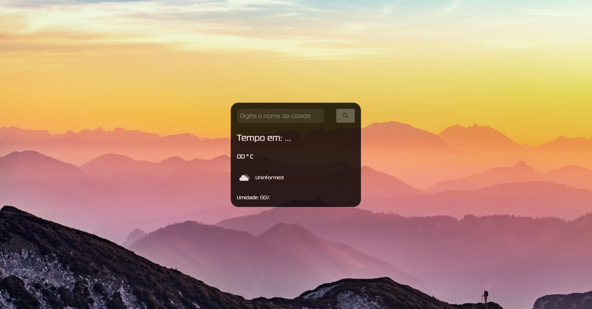

# PrevisaoDoTempo

 

## Descrição

- Projeto simples com consumo de API, para informar ao usuário, como esta o clima de respectivo local selecionado .

---
## Tecnologias utilizadas

- HTML

- CSS

- JavaScript

## 

 

Digite o local desejado e pesquise para ter suas informações .

- <a href="https://rodrigofrancosantos.github.io/PrevisaoDoTempo/" target="_ blank" >Teste o projeto, aqui !</a>

